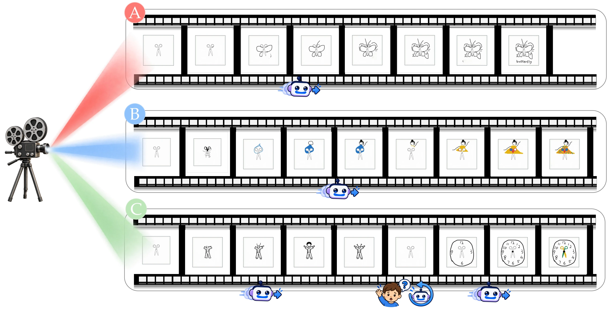

# DrawBreath

**Knowing When to Do Less: Adaptive AI Withdrawal in Children's Creative Drawing**

[Paper](assets/paper/drawbreath-paper.pdf) · [Code, Data & Study Materials](https://github.com/Draw-Breath/DrawBreath_Supplementary-Material)

DrawBreath explores how AI can support children's creative drawing while recognizing when to step back. Drawing on canvas activity and interaction history, the system makes three participation judgments—**Stay**, **Observe**, and **Withdraw**—with an interruptible fade and child-initiated re-entry.

In a single-condition study, **65 sixth-grade children** completed an open-ended drawing continuation task. Stable drawing followed **80% of completed withdrawals** (52 of 65 events), and **92.3% of children** reported being able to continue with their own ideas. Visual trajectories showed continued elaboration, revision, and later reorientation, sometimes accompanied by renewed help-seeking.

These findings frame withdrawal as a reversible adjustment within ongoing creation: AI can make room for children's ideas while remaining accessible. The study offers a descriptive account of this process, without establishing optimal withdrawal timing or comparative benefits.

